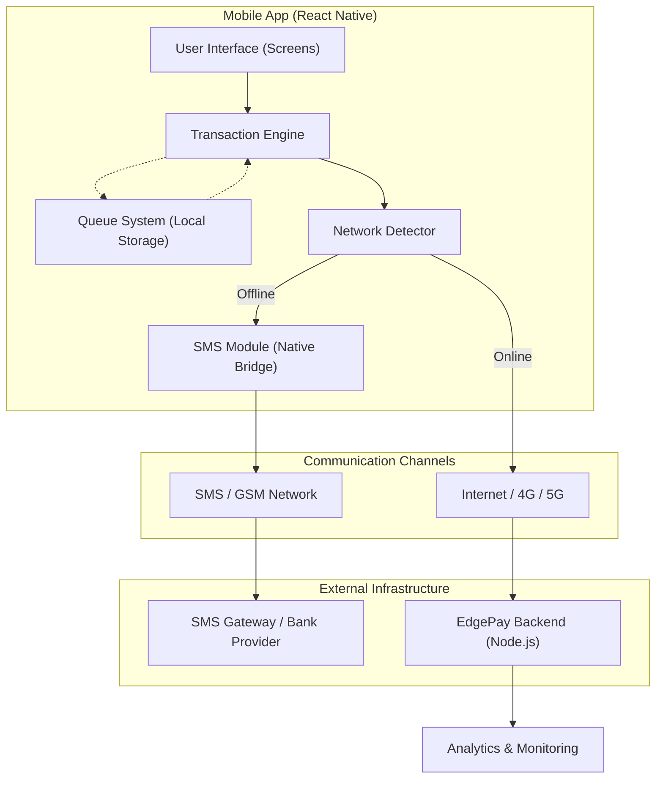
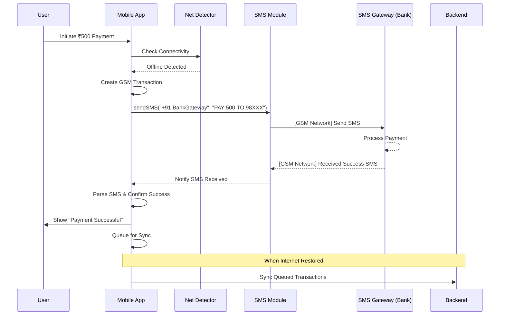
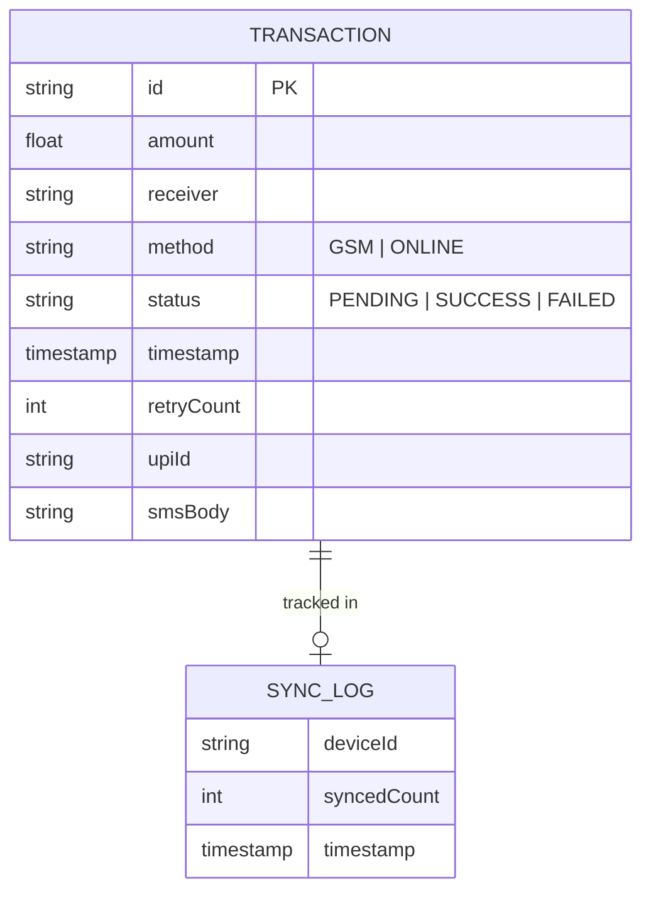
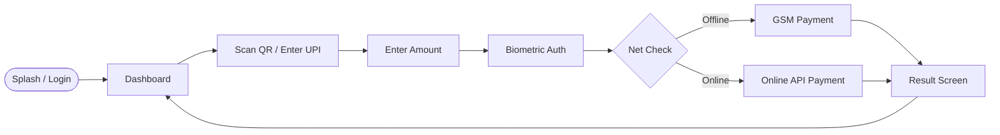

# EdgePay Technical Documentation Package

This document contains technical diagrams (Mermaid) and AI prompts for [Eraser.io](https://eraser.io) to help you create a stunning hackathon presentation.

---

## 🏗️ 1. System Architecture
**Description**: Shows the overall interaction between the Mobile App, GSM Network (for offline), and the Backend (for syncing).

### Mermaid Diagram

### 🖋️ Eraser.io Prompt
> Generate a high-level system architecture diagram for a mobile-first offline payment application named 'EdgePay'. The diagram should include a 'Mobile App' component built with React Native containing modules for Transaction Engine, Queue System (Local Storage), SMS Native Bridge, and Network Detector. Show two communication paths: one via 'Internet (4G/5G)' to a 'Node.js Backend' for syncing, and another via 'GSM Network (SMS)' to a 'Bank SMS Gateway' for offline processing. Use professional icons for mobile, cloud, and database. Theme: Sleek, Modern, Tech Hackathon style.

---

## 🔄 2. Offline Payment Flow (Sequence)
**Description**: Detailed step-by-step logic of how a payment is processed without internet.

### Mermaid Diagram

### 🖋️ Eraser.io Prompt
> Create a sequence diagram for an 'Offline Payment Flow' in the EdgePay app. Actors: User, Mobile App, Network Detector, SMS Native Module, and Bank/SMS Gateway. The flow: User initiates payment -> App checks network -> Detector returns 'Offline' -> App triggers SMS Module -> SMS sent to Bank Gateway -> Bank returns confirmation SMS -> App parses SMS -> App shows 'Payment Successful' to User -> App stores transaction in local queue for later sync. Style: Clean, Professional, readable lines.

---

## 💾 3. Data Model (ER Diagram)
**Description**: Database structure for handling transactions and sync logs.

### Mermaid Diagram

### 🖋️ Eraser.io Prompt
> Generate an Entity Relationship Diagram (ERD) for a payment application. Entity 1: 'Transaction' with fields: id (PK), amount, receiver, method (Enum: GSM/Online), status (Enum: Success/Fail), timestamp, retryCount, upiId, and smsBody. Entity 2: 'SyncLog' with fields: deviceId, syncedCount, and timestamp. Relationship: A SyncLog can track multiple Transactions. Use standard Crows Foot notation.

---

## 📱 4. App Navigation Flow
**Description**: user journey through the application.

### Mermaid Diagram

### 🖋️ Eraser.io Prompt
> Create a flowchart for the EdgePay mobile application navigation. Steps: Splash Screen -> Login/Biometrics -> Home Dashboard -> Initiate Payment (Scan/UPI) -> Enter Amount -> Biometric Authorization -> [Branch: Net Status] -> if Offline: GSM/SMS Processing -> if Online: API Processing -> Transaction Result Screen -> Back to Dashboard. Add logic nodes and descriptive labels.

---

## 📄 How to generate a PDF
1. **VS Code**: Open this file, right-click and selection **"Markdown PDF: Export (pdf)"** (if installed).
2. **Browser**: Simply copy this text into a Markdown editor (like [StackEdit](https://stackedit.io/)) and choosing **Print -> Save as PDF**.
3. **Markdown Tool**: Use `md-to-pdf` via npm if you have it installed.
